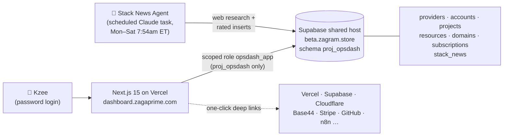

<div align="center">


# ZagaPrime Ops Hub

**One command center for everything ZagaPrime runs.**

Accounts → Projects → Resources → Domains → Stack News — mapped, searchable, editable, one click to every console.

🔗 **[dashboard.zagaprime.com](https://dashboard.zagaprime.com)** · private, password-protected


</div>

---

## Why this exists

ZagaPrime runs ~18 projects across **13 providers and 17 accounts** — multiple Supabase accounts, 4 Cloudflare accounts, 30 Vercel projects, 27 Base44 apps, AWS, Oracle, Stripe, n8n and more. Remembering which resource belongs to which project on which login was a tax on every working day. The Ops Hub is the answer: a single registry with analytics on top and an AI agent keeping watch.

## What's inside

| Tab | What it does |
| --- | --- |
| **Overview** | KPI tiles, resources-by-provider chart, environment + update-criticality donuts, per-project progress bars (hosting · database · domain · repo), needs-attention flags, domain health table |
| **Projects** | Card per project with its full stack expanded — every resource deep-links to its exact console page. Full CRUD: add, edit, delete, re-link |
| **Accounts** | Every login grouped by provider, with console + Bitwarden buttons. Secrets never live here — Bitwarden stays the vault |
| **Domains** | Every domain & subdomain: what it is, how it was built, resource mappings, and score bars for security, compliance, SEO, performance and risk posture |
| **News** | Daily AI-curated stack news rated by **criticality** and **time to implement**, tagged with the projects it affects, with a review workflow (new → reviewed → in-progress → done) |

## Architecture



**Design system:** light-first with dark accent sections, flat ZagaPrime blue `#2563EB`, Sora + IBM Plex Sans/Mono.

## Security model

- 🔑 **Single-password login** (`OPSHUB_PASSWORD`) → SHA-256 session cookie (`SESSION_SECRET`), 30-day expiry. Default-closed: no env vars, no access.
- 🗄️ **Scoped database role** — the app connects as `opsdash_app`, which can touch the `proj_opsdash` schema and nothing else. Never the service key.
- 🔐 **No stored secrets** — account cards hold *links* to Bitwarden items; credentials never enter this database.
- 🤐 `robots: noindex` — this is a private tool.

## Environment variables

| Variable | Purpose |
| --- | --- |
| `SUPABASE_DB_URL` | Pooler connection string for the `opsdash_app` role |
| `SUPABASE_DB_URL_ALT` | Optional fallback pooler host |
| `OPSHUB_PASSWORD` | Dashboard login password |
| `SESSION_SECRET` | Random string that signs session cookies |

## Develop

```bash
npm install
npm run dev        # http://localhost:3000
```

`/api/health` reports database connectivity. Every table edit in the UI writes through `/api/data/[entity]` — a whitelisted generic CRUD layer.

---

<div align="center">
<sub>Built by <a href="https://www.zagaprime.com">ZagaPrime Technologies</a> · maintained through Claude · © 2026 ZagaPrime LLC</sub>
</div>
