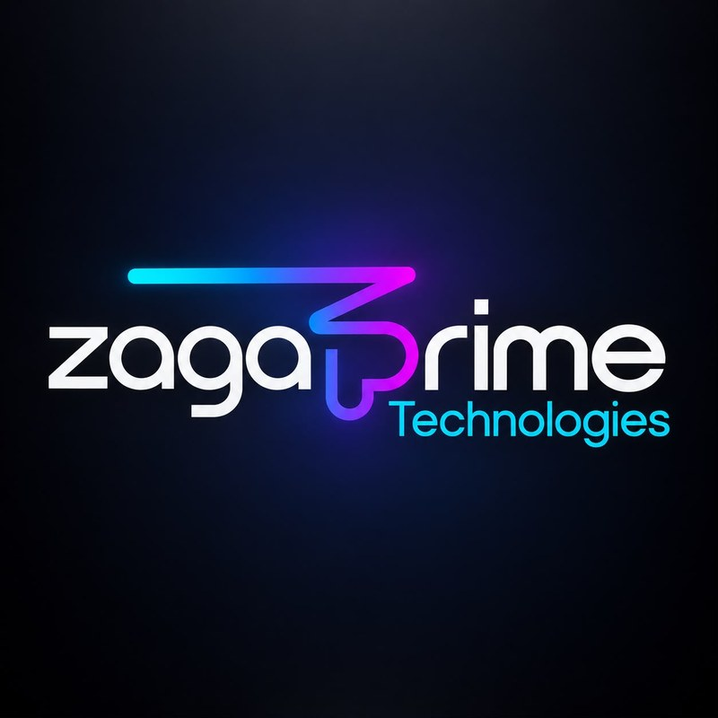
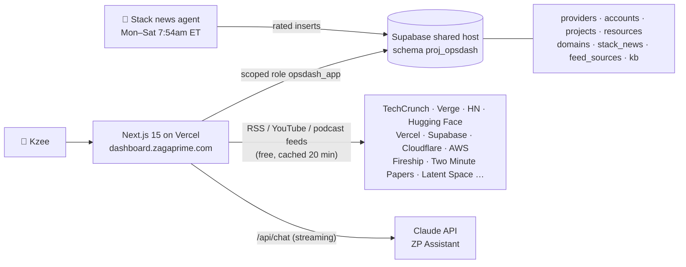

<div align="center">



# ZagaPrime Ops Hub

**One command center for everything ZagaPrime runs, plus a daily channel for tech, AI and deployments.**

Accounts → Projects → Resources → Domains → Stack updates → Channel → ZP Assistant.
Mapped, searchable, editable, and one click to every console.

🔗 **[dashboard.zagaprime.com](https://dashboard.zagaprime.com)** · private, password-protected


</div>

---

## Why this exists

ZagaPrime runs ~18 projects across **13 providers and 17 accounts**: several Supabase accounts, 4 Cloudflare accounts, 30 Vercel projects, 27 Base44 apps, AWS, Oracle, Stripe, n8n and more. Remembering which resource belongs to which project on which login was a tax on every working day. The Ops Hub is the answer: one registry, analytics on top, an AI agent watching the stack, and a daily news channel to stay sharp.

## What's inside

| Area | What it does |
| --- | --- |
| **Live ticker** | A rolling strip in the top menu with today's tech, AI, deployment and podcast headlines, video thumbnails, and critical stack alerts. Hover to pause, click to open. |
| **Overview** | Every block is a link. Tiles, provider bars, environment and criticality donuts, flags, per-project progress bars and stack badges, and the domain health table all jump to the exact filtered view. |
| **Projects** | A card per project with its full stack. Every resource deep-links to its console page, with full CRUD. URL filters: `?focus=` `?provider=` `?env=` `?kind=` `?show=unassigned` `?q=` |
| **Accounts** | Every login grouped by provider, with console and Bitwarden buttons. Filters: `?focus=` `?provider=` `?missing=bitwarden` |
| **Domains** | Every domain and subdomain: what it is, how it was built, resource mappings, and score bars for security, compliance, SEO, performance and risk posture. Filters: `?focus=` `?project=` `?sort=` |
| **Stack updates** | Daily agent findings rated by **criticality** and **time to implement**, tagged with the projects they affect, with a review workflow. Filters: `?crit=` `?project=` |
| **Channel** | Your tech-study feed: a hero carousel, YouTube videos that play in place, podcasts with inline audio, and articles from 31 free sources. Add or remove sources in the app. |
| **ZP Assistant** | A Claude chatbot on every page that knows the live registry, domains, open updates and today's headlines. Its answers link straight to the right page. |

## Architecture



## Brand

| Token | Value |
| --- | --- |
| Ground | `#060a17` dark navy (light mode available) |
| Gradient | `#14d4ff` → `#5f63ff` → `#a52cff` → `#ff00c8` |
| Mark | Vector ZP monogram in `components/logo.js`, plus favicon `app/icon.svg` |
| Type | Quicksand (wordmark), Sora (display), IBM Plex Sans / Mono |

## Security model

- 🔑 **Single-password login** (`OPSHUB_PASSWORD`) with a hashed session cookie (`SESSION_SECRET`). Default-closed.
- 🗄️ **Scoped database role.** `opsdash_app` can only touch `proj_opsdash`, never the service key.
- 🔐 **No stored secrets.** Account cards hold links to Bitwarden items only.
- 🤖 **The assistant runs server-side.** The Anthropic key never reaches the browser.
- 🤐 `noindex`, so search engines never list this tool.

## Environment variables

| Variable | Purpose |
| --- | --- |
| `SUPABASE_DB_URL` | Pooler connection string for the `opsdash_app` role |
| `SUPABASE_DB_URL_ALT` | Optional fallback pooler host |
| `OPSHUB_PASSWORD` | Dashboard login password |
| `SESSION_SECRET` | Random string that signs session cookies |
| `ANTHROPIC_API_KEY` | Powers the ZP Assistant |
| `ANTHROPIC_MODEL` | Optional model override (default `claude-sonnet-5-5`) |

## Develop

```bash
npm install
npm run dev        # http://localhost:3000
```

`/api/health` checks the database and `/api/feed-health` checks the news sources.

---

<div align="center">
<sub>Built by <a href="https://www.zagaprime.com">ZagaPrime Technologies</a> · © 2026 ZagaPrime LLC</sub>
</div>
